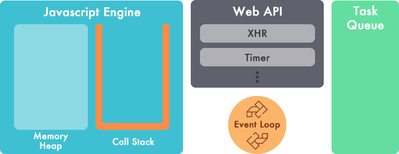
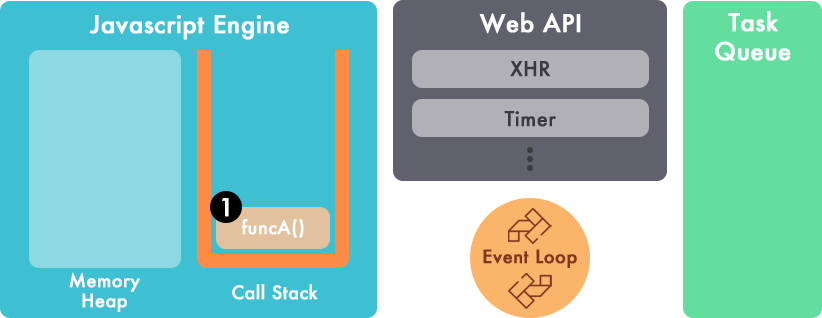
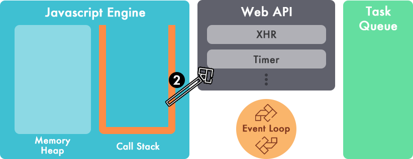
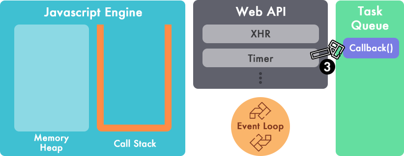
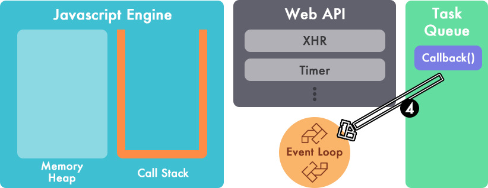
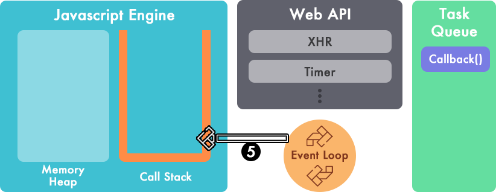
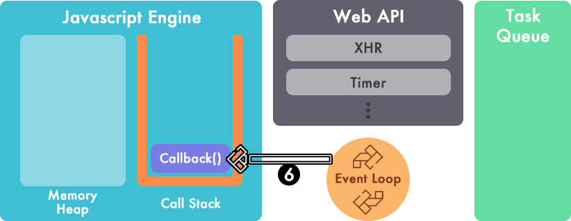

# Asynchronous Javascript
 일반적으로 C, Java 와 같은 언어는 별도의 Thread 등을 사용하지 않는 이상은 위에서 아래로 흐름에 따라 절차적으로 진행되는 언어와는 다른 특성을 지니지만 Javascript 는 특정 명령이 실행 되고나서 명령이 완료되기 전에 다음 명령이 실행될 가능성이 다분하다.

예를 들어보면,
```function funcA() {
	setTimeout(function() {
		console.log('funcA's result');
	}, 1000);
}

function funcB() {
	setTimeout(function() {
		console.log('funcB's result');
	}, 0);
}

funcA();
funcB();
```
위 코드의 실행 결과는 아래와 같다.
```funcB's result
funcA's result
```
의 순으로 출력 되는데,  개발 언어적 문맥으로 보았을때 Single Thread 이지만 위와 같은 경우 예외적인 상황이 많이 발생한다.

## Javascript Engine 내의 호출 스택 (Call stack)
기본적으로 자바스크립트 엔진은 Memory Heap 과 단일 호출 스택 을 가지고 있으며, 하나의 호출 스택을 가지고 있기 때문에 당연히 한번에 처리 가능한 함수의 갯수는 하나다.

 또 Stack 의 기본 구조를 따르기 때문에 함수를 Push (추가) 하고 실행시에 Pop (제거) 하는 순으로 진행되며 그 사이에는 다른 함수로 인한 Interrupt 가 발생할 수 없는 구조(Run-to-completion[^1])이다.
 
 만약 Javascript 가 자체 엔진 만으로 동작한다면 동시실행은 불가능 하겠지만 Javascript 는 자체 엔진 외에 다른 요소들과 함께 동작한다.


## Web API & Event Loop
 Web API 는 브라우저 에서 제공하는 API 들 이고 Timer, DOM, XHR(XMLHttpRequest or AJAX), DOM Handler, GeoLocation API 등이 있는데 이를 통해 **비동기 처리** 가 진행된다.

 맨 위의 예제 코드에서 사용된  **setTimeout** 은 Timer 에서 제공 받는 기능이며, **지정된 시간이후 callback을 task queue에 추가하는 역할을 수행한다.**
 바로 실행되는게 아니고, Task queue 에 추가 되는것이 포인트 인데, 만약 event loop 가 차단되는 경우나 몇몇 브라우저의 경우 기본적으로 최소 딜레이 타임이 0ms 보다 길게 설정되어 있는 경우 더 늦게 실행되는 것을 볼 수 있기 때문이다.
*firefox의 경우 4ms 가 설정되어 있다.*

* **setTimeout**: 지정된 시간 이후 콜백을 한번 실행
* **setInterval**:  지정된 시간 간격으로 콜백을 실행

Task Queue 는  Callback Queue 라고 부르기도 하며,  Web API 에서 제공받은 함수들을 Queue 형태로 저장하고, 자바스크립트 엔진의 Call Stack 에 누적된 작업들이 완료되면 순차적으로 Call Stack 에 추가한다.

 여기서 Call Stack 의 상태와 Task Queue 의 상태를 확인, 관리하는 것이 **Event Loop** 다.




```while (queue.waitForMessage()) {
    queue.processNextMessage();
}
```
> 위 코드는 MDN 에서 Event Loop 를 설명하는 가상 코드다.

## SetTimeout 의 경우 실행되는 순서
```function funcA() {
	setTimeout(function() {
		console.log('test console');
	}, 1000);
}
```
위 코드가 실행되는 순서

**메서드 실행**


**Timer 의 setTimeout 요청**  
이후에 funcA() 이후에 작성 되어있던 작업들은 연달아서 바로 수행되게 된다.


**지정된 시간 (1000ms) 만큼 대기하다가 Task Queue 로 Callback이 전달된다.**  


**이벤트 루프를 통해 호출 스택으로 전달하기 위해 대기**


**이벤트 루프가 호출 스택에서 동작중인 요소가 있는지 체크**



**호출 스택의 모든 처리가 완료됨을 확인하고 호출스택으로 Callback() 을 push()**


이렇게 호출스택으로 전달 된 callback() 은 실행이 되는 순서로 진행된다.

만약 setTimeout 에 지정된 Interval 이 0ms 일 경우에는 Timer 에서 대기하는 3번의 과정만 0ms 혹은 브라우저 최소 대기 시간일 뿐이지 메서드가 실행된 후 다음순번으로 대기중이던 호출 스택 요소가 모두 종료 된 후에 실행되게 된다.
```console.log('A');
setTimeout(function() { console.log('C'); }, 0);
console.log('B');
```
위 코드를 실행해보면 A -> B -> C 의 순으로 결과가 출력되는 것을 통해 알 수 있다.
 
## Continuation-passing style (CPS)
 setTimeout 이나 Event 들 처럼 Callback 을 매개 변수로 전달하는 프로그래밍 스타일을 *Continuation-passing-style* 이라고 부른다.
 이를 이용할 수 있다는 것은 Exception, Back-tracking, Thread, Generator 등의 제어구조를 추가할 수 있다는 것을 의미한다.

 Callback 을 이용하면서 CPS 의 스타일을 사용하게 되면서 장점도 분명히 존재하지만 코드 복잡도가 상승하면서 직관성이 떨어지는 단점이 존재한다. (a.k.a callback 지옥)

 보통 일반적으로는 입력 (매개변수) 와 출력 (결과) 사이의 구분이 명확하지만, Callback 을 사용하는 비동기 함수는 이 구분이 모호하기 때문에 복잡도는 계속 상승한다. (factorial 을 CPS 를 이용하여 구현하는 등...)

 또 다른 단점을 찾자면 에러 핸들러가 매개 함수로 전달되거나 내부에 종속되기 때문에 재활용이 어려워지게 된다.

 위의 단점들을 보충하기 위해 Promises 나 deferred 를 사용한다.

## Deferred & Promises
 Promises는 비동기 프로그래밍의 한 부분을 도와주는 패턴 이며, 함수 또는 메서드를 비동기적으로 결과를 받게 된다.
 Javascript 에서 Promises 의 표준은 결국 Promises/A+ 으로 보이며, ECMAScript6 의 promise API는 이 표준을 따른다.

es6 이전의 jQuery 가 주로 사용되던 때에는 deferred 를 이용하여 패턴을 사용했었다.

**deferred 방식**
```function funcA(){
  var deferred = $.Deferred();
  
	if (...) {
		deferred.resolve(success data);
	} else {
		deferred.reject(error data);
	}
  return deferred.promise();
}

deferred.done(function(data){
	// data == success data
});

deferred.fail(function(data){
	// data == error data
});
```

**es6 에서의 promise 생성과 사용**
```var promise = new Promise(() =>(resolve, reject) {
	...
	if (...) {
		resolve(value); // success
	} else {
		reject(reason); // failure
	}
});


promise.then(
	function (value) { /* fullfillment */ },
	function (reason) { /* rejection */ }
);
```
 then 에서 첫번째 인자를 null 처리 하거나 then 대신 catch 를 사용하면 성공후 처리를 제외하고 에러 핸들링만 하는 것도 가능하다.

 여전히 callback 이 존재하지만 promise 의 장점 중 하나는 then chaining (thenable) 을  통해 연달아 호출되는 처리를 flat 하게 만들 수 있다는 점이다.
```func1(function (value1) { // 기존
	function func2 (value2) {
		...
	};
})

// chaining
func1()
.then(function (value1) {
	...
	return func2();
})
.then(function (func2) {
	func2();
	...
})
```
그 외에도 all, race 등의 기능을 지원한다.


[^1]: 각 작업이 당시 모든 상태를 간섭의 우려 없이 완벽하게 제어 할 수 있음.